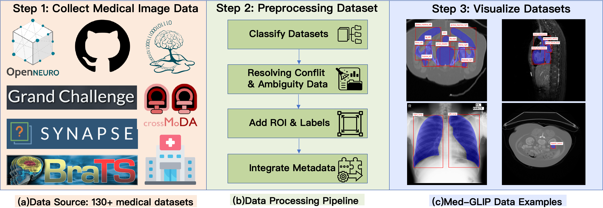

# Med-GLIP-5M

Please refer to the following link for more information about the dataset: [Med- GLIP-5M](https://modelscope.cn/datasets/Venn2025/Med-GLIP-5M).

This repository is the official code of paper "Med-GLIP: Advancing Medical Language-Image Pre-training with
Large-scale Grounded Dataset"

## Dataset Information
Med-GLIP-5M is a modality-aware grounding framework trained across heterogeneous datasets. Rather than relying on explicitly designed expert modules, Med-GLIP implicitly acquires hierarchical semantic understanding from diverse training data — enabling it to recognize multi-granularity structures, such as distinguishing lungs from pneumonia lesions.

This dataset comprises over 11 million medical images across 7 modalities, covering diverse anatomical regions. Originally annotated with 198 fine-grained labels, these have been reorganized into 38 semantically coherent classes spanning 6 major body regions. This hierarchical, multimodal structure supports a wide range of tasks, including organ-level segmentation, multi-organ detection, cross-modal learning, and domain adaptation.

  

## Requirement
To set up the environment of mmdetection, check the official website of [mmdetection](https://mmdetection.readthedocs.io/en/latest/get_started.html)

After setting up the python environment, you are able to train or evaluate a model using our Med-GLIP-5M dataset

## File Description
